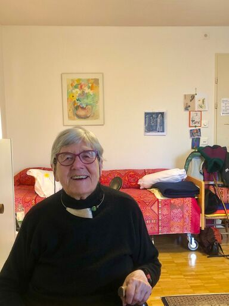

+++
title = "Wie es wirklich ist: Eine ältere Dame spricht über das Leben im Altersheim"
date = "2025-02-11"
draft = false
pinned = false
tags = ["Interview"]
image = "whatsapp-bild-2025-02-09-um-16.17.00_4f46bed3-1-.jpg"
description = ""
+++
<!--StartFragment-->

Wie fühlt es sich an, wenn das Leben langsamer wird, aber die Gedanken wach bleiben? Eine Bewohnerin im Altersheim, Frau Hänseler erzählt von ihren Alltagsgeschichten und dem Wunsch nach mehr Beachtung und Wertschätzung. 

Es ist Vormittag und wir betreten ein bisschen aufgeregt das Altersheim “Domicil”. Frau Hänseler erwartet uns im 5. Stock  in ihrem kleinen “Stübeli”. Vor ihrer Wohnungstür hängen tibetische Gebetsfahnen. Als wir anklopfen und die Tür öffnen, begrüsst uns Frau Hänseler mit einem herzlichen Lächeln und lädt uns ein, Platz zu nehmen.  An den Wänden hängen Bilder, die aus ihren Asien Reisen stammen. Von ihrem Fenster aus hat Veronika einen wunderschönen Ausblick über die Stadt Bern und Umgebung. Frau Hänsler wirkt auf uns wie eine wissens interessierte, offene, positiv gestimmte Frau. 

**Wie fühlt es sich an, im Altersheim zu leben?**

Im Altersheim zu leben ist etwas ganz anderes als Zuhause. Viele Dinge hat man auch nicht mehr. Für mich war es eine enorme Umstellung. Ich musste ins Altersheim ziehen, weil ich kaum noch etwas sehen konnte. Beispielsweise sehe ich bei einem Wort oft nur den zweiten und dritten Buchstaben – der erste Buchstabe ist für mich wie verschwunden oder kaputt. Auch Kartoffeln schälen kann ich nicht mehr, denn am Ende sieht die geschälte Kartoffel aus wie ein Zebra. Weil ich früher an Kinderlähmung erkrankt war und dadurch in meiner Bewegungsfreiheit eingeschränkt bin, benötige ich im Alltag Unterstützung, zum Beispiel beim Waschen meiner Wäsche oder beim Putzen meiner Stube. Trotzdem versuche ich, viele Dinge selbständig zu erledigen, wie zum Beispiel das Machen meines Bettes. Glücklicherweise habe ich mein Radio von zu Hause mitgenommen, über das ich täglich meine amüsanten Lieblingssender hören kann.

> *“Ich fühle mich wohl und auch privilegiert hier” (Veronika Hänseler)*

**Welche Orte mögen Sie hier besonders ?**

Gottlob haben wir einen schönen, aber kleinen Garten. Ich habe Freude am Garten, weil mich die Kulisse an das "West Side Story" Musical erinnert. Die Umgebung ist genau wie im Film, weil das Haus gegenüber lauter Balkone hat, die voller Glyzinen sind. Es fehlt nur noch die Hauptdarstellerin “Maria”, die auf der Treppe steht. Neben dem tollen Garten zieht es mich auch oft in die Bibliothek, die sich im 6. Stock befindet. Ich liebe Bibliotheken über alles und verbringe sehr gerne Zeit dort. 

**Was gibt es hier für Angebote?**

Wir haben ganz viele Angebote, wie Gedächtnistraining, Presseschau, Französischkurs, Bewegungstraining oder das Filme schauen mit anderen Bewohner*innen. Das schönste finde ich das Singen, “Singen mit Otto”. Ich sage Ihnen, das ist eine "pleasure", mit ihm zu singen. In meinen Augen singen wir manchmal auch viele unsinnige Lieder, beispielsweise Alpenlieder.

**Kommt man schnell in Kontakt mit anderen Bewohner*innen?**

Es kommt ganz darauf an, wie man eingestellt ist.  Da viele fast nichts mehr hören, ist es umso schwieriger, mit ihnen Kontakt aufzunehmen. Ich habe mit einer Bewohnerin sehr engen Kontakt, die etwa um die gleiche Zeit eingezogen ist wie ich. Zusammen können wir lachen und sie ist genauso kontaktfreudig wie ich. Diese Frau ist so umgeben, alle möchten mit ihr ins Gespräch kommen. Es ist einfach toll. 

**Was schätzen Sie an diesem Altersheim?**

Man hat die Möglichkeit, Essen zu gehen, ohne selbst noch kochen zu müssen. Bei uns im Esssaal gibt es immer wieder Bewohner*innen, die Hilfe beim Essen benötigen. Beispielsweise ist bei uns am Tisch so jemand. Manchmal schreit die Bewohnerin irgendwo dran oder schmeisst das Glas beinahe um. In solchen Situationen gibt es Menschen, die helfen.  

**Was gefällt Ihnen weniger gut an diesem Altersheim?**

Jeden Tag haben wir jemand anderes auf der Abteilung. Es gibt nicht so viel Personal. Die meisten vergessen an was man leidet und die meisten vergessen sofort, dass ich manche Dinge nicht sehen kann. Ich möchte es ihnen nicht übel nehmen, aber manchmal werde ich ein bisschen verrückt. Manche können ganz schlecht Deutsch und dann versuchte ich mit ihnen Englisch zu reden, was dann meistens klappt. Trotzdem schätze ich das Personal sehr und man merkt, dass sie sich Mühe geben.  Unser Altersheim  ist schon wieder teurer geworden. Und dabei ist das Domizil nicht einmal das vornehmste. Ich bin jetzt 2.5 Jahre hier und sie haben 3 mal die Preise erhöht. Ich hatte sehr wenig auf der Bank, da ich immer ein “Reisefüdli” war. 

**Wie können wir verhindern, dass sich ältere Menschen einsam und isoliert fühlen?**

Man muss in einem Altersheim eine oder zwei Personen haben, die Ideen spenden können und natürlich braucht es auch sehr aufmerksames Pflegepersonal. Die merken, warum sich Bewohner*innen alleine fühlen. Das Problem ist aber, dass das Pflegepersonal nicht sofort bemerkt, dass es jemandem schlecht geht, da sie jeden Tag auf einer anderen Abteilung eingeteilt sind.

**\
Haben Sie das Gefühl, dass es eine gewisse Spaltung zwischen den verschiedenen Generationen gibt?**

Ja, das habe ich in gewissen Bereichen gemerkt, aber man stempelt euch damit auch einfach nur ab. Manche starren nur auf das Handy, aber in den Bussen ist es super, wie die Menschen aufstehen, alle "Burschen" und auch "Mädi". Macho Typen zwischen 16 und 30 stehen nicht viel auf. Ich bin manchmal auch beschämt, weil manche einfach so schnell aufstehen und Platz machen, obwohl es noch genug Platz hätte im Bus.

**Gibt es etwas was Sie den jüngeren Generationen gerne sagen möchten?**

Ja, einfach umsichtig sein. Es fällt mir zum Beispiel auf, wenn ich an einer Ampel stehe, viele Menschen mir helfen und mich fragen, ob sie mit mir über die Strasse gehen sollten, wie ihr und das schätze ich extrem. Es ist unglaublich, wie aufmerksam die Menschen sind.



Infokasten

Veronika Hänseler, auch “Vroni” genannt, lebt seit etwa 2.5 Jahren im Altersheim Mon Bijou Domicil etwas ausserhalb der Stadt Bern. Sie ist eine sehr offene, herzliche und ehrliche Person, die es mag, zu nähen oder auch zu lesen. Sie erzählt einige Alltags-Anekdoten, wie es ist im Altersheim zu leben, ob der Respekt für ältere Menschen weniger geworden ist und was man noch alles im Altersheim oder auch sonst in der Schweiz ändern sollte.



<!--EndFragment-->